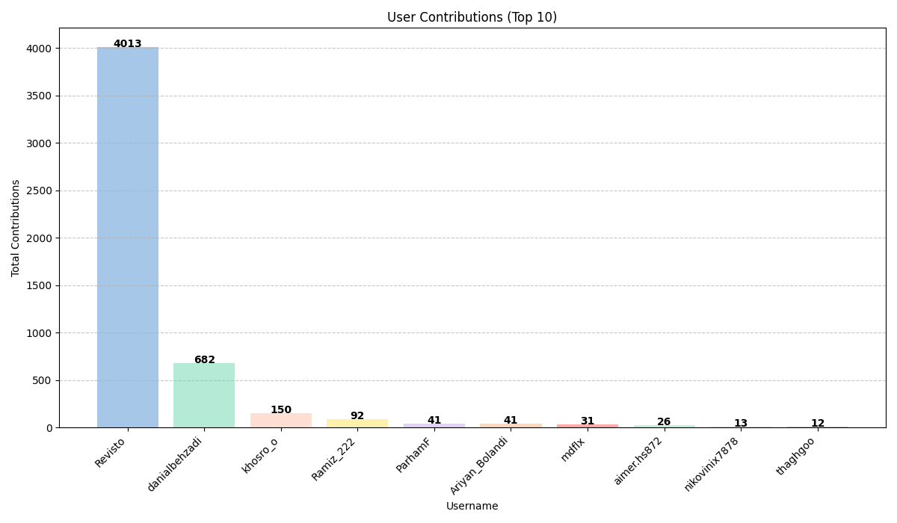

# ترجمه مستندات پایتون به فارسی 🐍💛

[](https://discord.gg/yeqtNeaFYf)
[](https://www.youtube.com/watch?v=DH5c5ZutTCo)

## درباره پروژه

ما توی این پروژه گروهی از علاقه‌مندان به پایتون هستیم که روی ترجمه مستندات رسمی پایتون به فارسی می‌کنیم. هدف ما این است که حتی کاربرانی که تسلط کامل به زبان انگلیسی ندارند، بتوانند با استفاده از راهنمایی‌های دقیق و به‌روز، اصول برنامه‌نویسی پایتون را به راحتی یاد بگیرند.

## راهنمای مشارکت 🌱

ترجمه‌ها دیگر روی Transifex انجام نمی‌شوند و مستقیماً از طریق پول‌ریکوئست در همین ریپازیتوری مدیریت می‌شوند. فایل‌های `.po` هر کدام به بخشی از مستندات پایتون (مثل `tutorial/`، `library/` یا `c-api/`) مربوط‌اند و می‌توانید هرکدام را جداگانه ویرایش و پول‌ریکوئست بزنید.

خلاصه فرایند مشارکت:

1. ریپازیتوری را فورک و کلون کنید.
2. فایل `.po` مورد نظر رو با [Poedit](https://poedit.net/) باز کنید (رشته‌های ترجمه‌نشده یا fuzzy را می‌توانید از پنل فیلتر پیدا کنید).
3. متن انگلیسی (`msgid`) را ترجمه کنید و در بخش ترجمه (`msgstr`) وارد کنید.
4. نشانه‌گذاری‌های Sphinx مثل `` :class:`int` ``، `` :func:`repr` ``، `` ``code`` ``، و جای‌گزین‌هایی مثل `%s` یا `{name}` را دقیقاً بدون تغییر نگه دارید؛ فقط متن اطراف آن‌ها ترجمه می‌شود.
5. پیش از ارسال پول‌ریکوئست، بررسی کنید فایل‌ها مشکلی ندارند:
```bash
   msgfmt --check your_file.po
   python3 scripts/check_markup.py your_file.po
```
6. پول‌ریکوئست را باز کنید — روی هر پول‌ریکوئست به‌صورت خودکار بررسی‌های لازم اجرا می‌شود.

برای دیدن این‌که کدام فایل‌ها هنوز نیاز به ترجمه دارند و چقدر از هرکدام باقی مانده:
```bash
python3 scripts/translation_status.py --only-incomplete
```

راهنمای کامل‌تر مشارکت (شامل نحوه‌ی همگام‌سازی با نسخه‌های جدید پایتون و اسکریپت‌های موجود در `scripts/`) در [RESOURCE.md](RESOURCE.md) موجود است.

## ارتباط و هماهنگی

برای بحث، هماهنگی و به‌روزرسانی‌های مرتبط با ترجمه، می‌توانید از کانال‌های زیر استفاده کنید: 

<ul dir="rtl">
    <li><a href="https://discord.gg/yeqtNeaFYf">Discord مستندات پایتون به فارسی</a></li>
    <li>بخش <a href="https://github.com/python/python-docs-fa/issues">Issues</a> در این ریپازیتوری جهت گزارش مشکلات یا پیشنهادات</li>
</ul>

***

با تشکر از همراهی شما در گسترش و بهبود مستندات پایتون به زبان فارسی!

<!-- STATS_START -->
### مشارکت‌های کاربران

(به‌روزرسانی: 2025-07-12)
<!-- STATS_END -->
