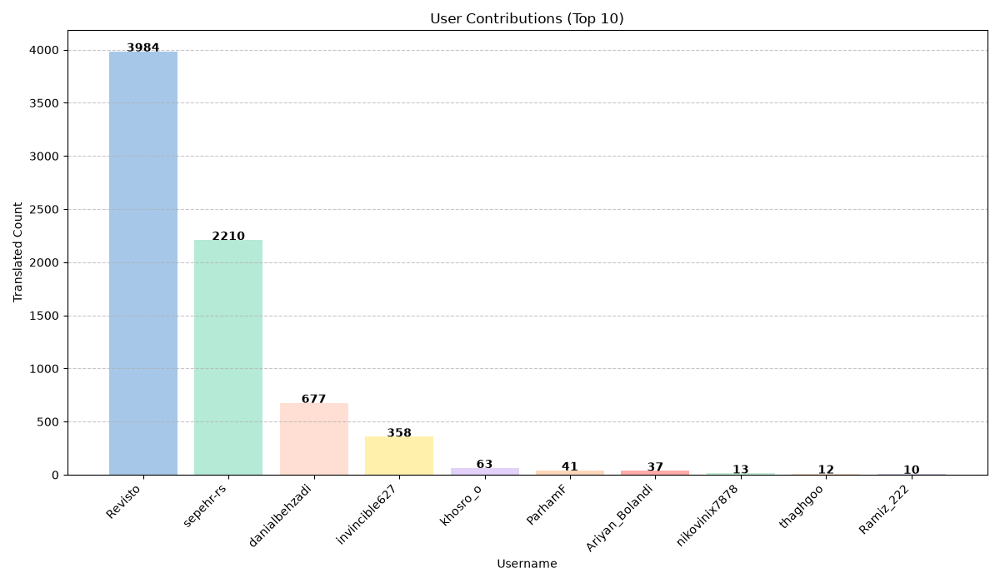

# ترجمهٔ مستندات پایتون به فارسی 🐍💛

## دربارهٔ پروژه

این پروژه گروهی از علاقه‌مندان به پایتون است که مستندات رسمی پایتون را به فارسی ترجمه می‌کنند. هدف این است که کاربرانی که تسلط کاملی به زبان انگلیسی ندارند نیز بتوانند با استفاده از راهنمایی‌های دقیق و به‌روز، اصول برنامه‌نویسی پایتون را به‌راحتی یاد بگیرند.

## مجوز

ترجمه‌ها مطابق [PEP 545](https://peps.python.org/pep-0545/) تحت مجوز [CC0 1.0 Universal](LICENSE) منتشر می‌شوند؛ یعنی در مالکیت عمومی (Public Domain) قرار دارند و می‌توانید بدون هیچ محدودیتی از آن‌ها استفاده، کپی و بازنشر کنید.

## راهنمای مشارکت
راهنمای کامل مشارکت به پروژه، از جمله نکات نگارشی و تایپوگرافی فارسی، در [CONTRIBUTING.md](CONTRIBUTING.md) آمده است.

### منابع پیشنهادی

پیش از شروع، حتماً نگاهی به این فایل‌ها بیندازید:

- [CONTRIBUTING.md](CONTRIBUTING.md) — راهنمای کامل مشارکت: انواع ایشیو، نکات نگارشی و تایپوگرافی فارسی، سطح رسمیت و لحن نوشتار، اندازهٔ پول‌ریکوئست، فرایند بازبینی و تأیید پول‌ریکوئست، همگام‌سازی با نسخه‌های جدید پایتون (`scripts/update_python_version.py`)، پاک‌سازی رشته‌های `fuzzy` و نگهداری اعتبار مترجمان در سربرگ فایل‌های `.po`.
- [GLOSSARY.md](GLOSSARY.md) — واژه‌نامهٔ معادل‌های فارسی اصطلاحات تخصصی؛ هنگام ترجمه باید به آن پایبند باشید.
- [TEAM.md](TEAM.md) — فهرست هماهنگ‌کننده‌ها، بازبین‌ها و مترجمان به‌همراه آمار مشارکت.
- [STATUS.md](STATUS.md) — جدول وضعیت ترجمهٔ فایل‌ها که به‌صورت خودکار به‌روزرسانی می‌شود.

### شاخه‌های نسخه

ترجمه‌ها به‌ازای هر نسخهٔ پایتون در یک شاخهٔ جدا نگهداری می‌شوند. شاخهٔ فعلی و پیش‌فرض، نسخهٔ `3.14` است و پول‌ریکوئست‌ها باید روی همین شاخه باز شوند (برای مثال روی فایل‌های `tutorial/`، `library/`، `c-api/` و غیره). هنگام انتشار نسخهٔ جدید پایتون، هماهنگ‌کننده‌ها شاخهٔ جدیدی ایجاد و ترجمه‌ها را به آن منتقل می‌کنند.

## ارتباط و هماهنگی

برای بحث، هماهنگی و به‌روزرسانی‌های مرتبط با ترجمه، می‌توانید از کانال‌های زیر استفاده کنید:

<ul dir="rtl">
    <li><a href="https://discord.gg/yeqtNeaFYf">Discord مستندات پایتون به فارسی</a></li>
    <li>بخش <a href="https://github.com/python/python-docs-fa/issues">Issues</a> در این مخزن جهت گزارش مشکلات یا پیشنهادات؛ سه قالب موجود است: درخواست ترجمهٔ صفحه، پرسش یا پیشنهاد واژه‌نامه، و گزارش اشکال در ترجمه.</li>
</ul>

تمام مشارکت‌کنندگان موظف‌اند از [آیین‌نامهٔ رفتاری PSF](https://www.python.org/psf/conduct/) پیروی کنند.

***

با تشکر از همراهی شما در گسترش و بهبود مستندات پایتون به زبان فارسی!

<!-- STATS_START -->
### مشارکت‌های کاربران

(به‌روزرسانی: 2026-08-26)
<!-- STATS_END -->